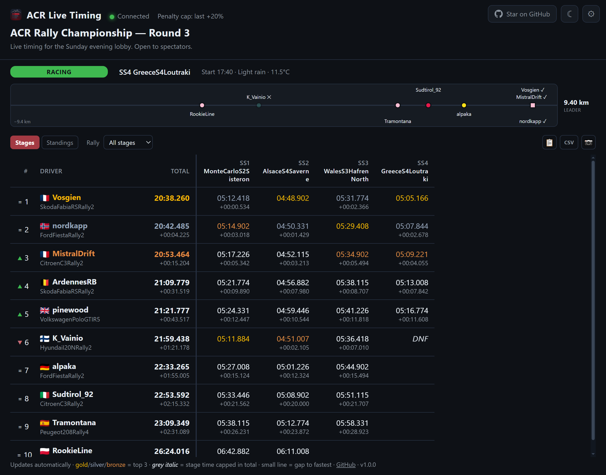
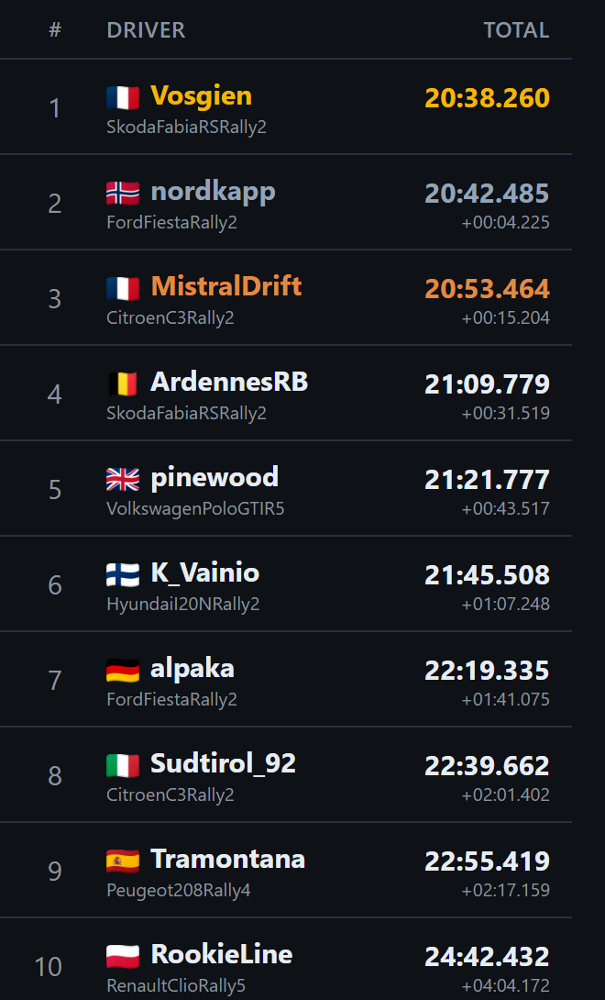
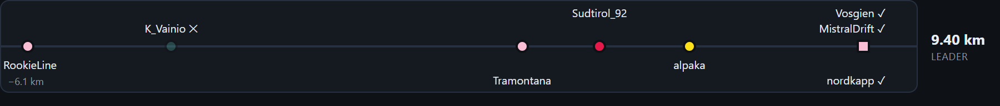
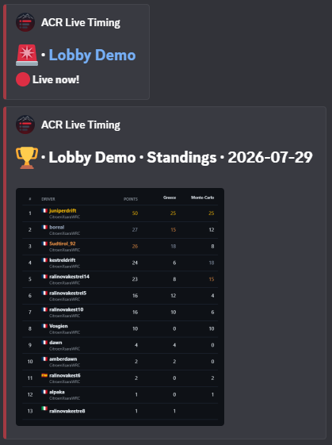

# ACR Live Timing

[](https://github.com/FlorentDChamps/acr-live-timing/actions/workflows/build.yml)

**Live timing and shared leaderboard for Assetto Corsa Rally multiplayer lobbies.**

*Read this in [French / en français](README.fr.md).*

ACR shows stage results only inside the lobby, on each player's own screen. This app
passively decodes the game's network traffic on one player's PC and turns it into a
**live leaderboard web page** — every finisher's time (penalties included), nation
flag and car — that the whole lobby can follow in a browser, stage after stage, with
running session totals. Share it on the LAN or publish it to anyone with a one-click
Cloudflare tunnel link.



<sub>Demo data — fictional pseudonyms, placeholder server address.</sub>

> ⚠️ **Passive analysis tool, for personal/educational use.** It only *reads* the
> traffic of lobbies you are playing in. It modifies nothing, injects nothing, and
> gives no driving advantage.

> **Unofficial fan-made project.** Not affiliated with, endorsed by, or associated
> with Kunos Simulazioni, Supernova Games Studios or 505 Games. *Assetto Corsa* is a
> trademark of its respective owners; the name is used here only to indicate
> compatibility. The tool reads **cleartext traffic only** and will never attempt to
> decrypt, defeat or work around any protection.

---

## Features

- **Zero configuration** — join an ACR lobby; the game server is auto-detected by
  protocol signature (IP and port change every lobby, nothing is hardcoded).
- **Live stage results** — driver names, split-validated final times (ms-exact vs
  the in-game screen, penalties included), stage name, nation flag and car model.
  The displayed car list follows the selected stages, preserving a driver changing
  car between stages and removing duplicate models. While a stage is running
  (Racing through Spectating, back to the stage history at Results), with
  **Hide split times** off (the default), the board keeps the total pinned on the
  left and replaces stage history with cumulative
  sector splits followed by the final stage time. Each column shows its gap and top
  three, while rows automatically follow the latest available split classification.
  The regular stage history returns at Results.
- **Session classification** — one column per stage run, running totals and ranks.
  Configurable *penalty-cap rule*: a driver missing a stage is counted at
  `slowest completed time × (1 + penalty-cap %)` and flagged.
  Any stage can be excluded from the totals with a checkbox. A stage you join already
  under way is **not** counted — its start was missed — but its name and the
  driver/car bindings are still learned, so the next, fully-captured stage is ready
  from the first split. Columns are sortable (any stage or the total), and
  rank-change arrows next to each driver show their movement on the latest stage.
- **Rallies, standings & championship points** — group stages into named rallies
  from the host panel (*Stages — select to group*: tick the stages, click **Group**,
  rename inline). The web page gains a **Standings** tab: an independent
  classification per rally plus championship points (25-18-15-12-10-8-6-4-2-1 per
  rally), sortable by any rally or by the points total; the main board gets a rally
  filter to show a single rally's stages. Grouping is host-defined and shared with
  every viewer.
- **Result exports** — three buttons on the page export exactly what is displayed:
  copy as text, CSV (Excel-ready, locale-aware separator) and PNG image. On the host
  side, an optional **Discord webhook** (Discord panel) posts to your channel in one
  click: a live-link alert, the standings board or a selected rally's results as an
  image. The webhook URL is stored encrypted, readable only by your Windows account.
- **Hide split times** — in the stage history, a driver's final time is validated
  only once they actually cross the finish line. Detection is event-driven and exact:
  the game replicates a per-car race phase
  (`RaceStateData.Phase`); the transition to *Ended* marks the finish the instant it
  happens, with the frozen stage timer matching the displayed result to the
  millisecond. Streamed packet-by-packet, so replays reveal the same progression as
  live regardless of playback speed. A tool locking on mid-session re-identifies the
  timer stream from its wire shape, so no stage restart is needed; only genuinely
  timer-less captures (older recordings) fall back to split-completion gating.
  **Hide split times** is off by default: leave it off for the dedicated live sector
  board, or turn it on to keep the former stage-history board and hide intermediate
  times until the finish.
- **DNF display** — a driver who never crossed the line is shown as **DNF** on that
  stage (counted at the penalty cap, like an absence). On the running stage it
  appears the moment the car's race phase turns *Retire/Disqualify*; when a stage
  closes, each car's fate is snapshotted (retired, disqualified or vanished
  mid-run), so past stages keep an exact DNF record, with a peer-finish inference as
  fallback for capture gaps. The retirement flag of the game's replicated results is
  also decoded directly, so even a driver who quits **before the first split** is
  listed as DNF — with no time, since none was ever set — instead of silently
  disappearing.
- **Live stage progression** — a horizontal track above the board shows every
  driver's live position along the current stage. By default the track spans a
  **fixed configurable range** behind the leader (a stable scale); unchecking
  *Fixed* in the Config panel switches to an auto-fitting window stretching between
  the leader and the last running car, capped at that range. Each marker is
  named **at spawn, from the start line**: the car's owner PlayerState actor
  re-replicates its identity block (steamid + display name) every stage, and the
  decoder binds it to the car's telemetry component deterministically. A sector-split
  time-match remains as fallback (e.g. when the tool locks on mid-stage), so a car
  not yet identified shows as an anonymous dot until its first split. During the
  **first stage** after the tool locks on, data can therefore be partial: some
  markers may stay anonymous for a while and the board fills in as the first splits
  arrive. Everything is complete from the next stage on.
- **Lobby & stage header** — the page header shows the current lobby phase (Loading,
  Racing, Results, Service park…), the stage's **in-game start time** (time of day)
  and its **weather forecast**, all decoded from the replicated weather timeline and
  the lobby state machine.
- **Shareable web view** — embedded web server for the LAN, plus an optional public
  `https://….trycloudflare.com` link. The pinned `cloudflared` binary is downloaded
  once and **SHA-256-verified** against Cloudflare's published checksum before use.
  The Start / Publish buttons double as stop controls, and the public link has a
  one-click copy button.
- **Per-viewer display settings** — a gear button on the web page opens a panel that
  mirrors the host's ranking/display controls **locally**: exclude stages from the
  totals, change the penalty cap %, resize the progression window or toggle its
  fixed range, hide nationalities, toggle **Hide split times**, filter by rally, sort by
  any column, and
  switch the page's light/dark theme. Changing a stage/penalty/gating setting
  recomputes the board in the browser from the raw per-stage data the page already
  receives, so it never touches the host's own view or any other viewer. Settings are
  session-only (a reload reverts) and a **Reset to host config** button restores the
  host's published setup. Hidden in the OBS overlay modes. Saving the page with the
  browser's own **Save page as** bakes in the current standings, so the saved file
  opens offline (no server) with the settings panel still fully functional.
- **Custom page heading & link preview** — set an optional title and description
  (top-left panel) shown at the top of the shared page; URLs typed in either are
  clickable. Open Graph / Twitter Card metadata is emitted too, so pasting the link
  in Discord, Facebook, WhatsApp… shows that title and description as a rich preview.
- **Streaming overlays (OBS)** — two independent, resizable, transparent windows —
  one with the **general classification**, one with the **live progression bar** —
  that reuse the web page. Each is configured on its own in the *Overlays* panel:
  show/hide, *always-on-top*, click-through *lock*, and **background opacity** (in
  10 % steps). Resize to zoom them, then float them straight over the game as an
  on-screen overlay while you race. For OBS, capture them as **Browser Sources**
  instead — the *Overlays* panel has a *Copy OBS source URL* button per widget (see
  [Streaming with OBS](#streaming-with-obs)). (Start the local web server first —
  overlays load from it. A borderless / windowed-fullscreen game is required for a
  desktop overlay to sit on top; exclusive fullscreen can't be covered.)
- **Light or dark, everywhere** — the app picks up your Windows light/dark setting
  on launch, with a toggle in the header to switch at any time. The web page follows
  each viewer's own system theme too, with its own sun/moon toggle.
- **Update notice at startup** — a lightweight version check against this
  repository's releases; if a newer build exists, a popup links to it (nothing is
  downloaded without your confirmation) and can be dismissed per version.
- **Record & replay** — optionally record the session to a standard `.pcap` file
  (Wireshark-compatible) and replay it later through the same decoding pipeline.
- **Remembers your setup** — all window state (options, page title/description, the
  Discord webhook — encrypted — and each overlay's position, size, always-on-top,
  lock and opacity) is saved to an `ACRLiveTiming.config` file next to the exe and
  restored on the next launch.
- **No capture driver** — a Windows raw socket is used instead of Npcap/WinPcap;
  the only requirement is running as Administrator.

## Privacy & security — what this app actually does

This app needs Administrator rights and touches the network, so here is the full
picture, plainly:

- **Why Administrator?** Reading inbound packets without a capture driver requires a
  Windows raw socket (`SIO_RCVALL`), which Windows only grants to elevated processes.
  Elevation is used for that single purpose.
- **What is captured?** Inbound UDP traffic of *your own* machine, in memory. Once
  the ACR server is detected, only its packets are decoded; everything else is
  ignored. Nothing is written to disk unless *you* enable pcap recording (and then it
  is a local file you choose). Note that the raw socket sees **all** inbound traffic,
  so a debug `.pcap` contains more than game packets — treat capture files as
  sensitive and think twice before sharing one.
- **What is decoded?** Exactly what the game already shows in the lobby: driver
  pseudonyms, stage times, penalties, stage name, nation, car model. The game also
  replicates stable account identifiers (Steam/EOS); the app uses them only
  internally, to keep a driver's results on one row across a pseudonym change — they
  are never displayed, never published on the page and never included in any export.
  No real-name field is read.
- **What leaves your machine?** Nothing, by default. The app has no telemetry and
  uploads nothing. Its only outbound connections are: (1) a lightweight startup check
  to GitHub for a newer ACR Live Timing release — no download occurs unless you confirm
  its popup; (2) a one-time download of the pinned, checksum-verified `cloudflared`
  binary from Cloudflare's official GitHub releases — fetched automatically in the
  background at first launch, even if you never publish; (3) the Cloudflare tunnel itself,
  *only if you click Publish* — from that
  moment the leaderboard page is reachable by anyone who has the link, until you
  close the app. If the app dies without closing normally (crash, Task Manager kill),
  the tunnel process can outlive it — check for `cloudflared.exe` in Task Manager;
  (4) a message to Discord, *only if* you paste a webhook URL in the Discord panel
  and click one of its buttons — it posts the alert or results image to that channel
  and nothing else.
  (Browsers viewing the page also fetch flag images from flagcdn.com.)
- **Who can see the local page?** The embedded web server listens on all network
  interfaces, so anyone on the same LAN/Wi-Fi can open the page while the server
  runs (that is the point — sharing with the lobby). Stop the server (**Start**
  again) when you are done.
- **What it will never do:** send packets to the game server, modify game files or
  memory during play, or interact with the game process in any way. It is a listener.

### Publishing a public link — other players' data

The leaderboard shows other drivers' pseudonyms and, by default, their nationality.
That is **personal data of third parties**. On your LAN, among the people you are
already playing with, this is fine. But the **Publish** button exposes it on the
public internet to anyone who has the link, which is a different responsibility:

- The public link is never automatic — it is a deliberate click, and the app asks
  you to confirm before opening it.
- The **"Hide nationalities (shared view)"** option (Config panel) removes the nation
  flags from the shared page; names and times still show.
- If you publish, share the link only with people who should see it, and close the
  app (or the tunnel) when you are done. Nothing is stored: shut it down and the
  page is gone.

## How it works

```
UDP traffic ──> raw-socket sniffer ──> server auto-detection
                                              │
                                              ▼
               Unreal Engine replication decoding (cleartext)
   names · splits · penalties · stage · nation · car · race phase/timer
        spline distance · lobby phase · stage start time · weather
                                              │
                                              ▼
               session matrix ──> embedded web server ──> browser
                                         │
                                         └──> Cloudflare quick tunnel (optional)
```

ACR is built on Unreal Engine; its multiplayer traffic is standard UE replication,
currently unencrypted in the server→client direction. The app reads that cleartext
stream to surface exactly the values the game already shows in the lobby. Nothing
about the game binary is read, modified, patched or redistributed.

## Getting started

### Requirements

- Windows 10/11 x64
- [.NET 8 Desktop Runtime](https://dotnet.microsoft.com/download/dotnet/8.0)
  (the SDK if you build from source). If it is missing, Windows shows a dialog
  with a direct download link the first time you launch the exe — install it
  once, then relaunch.
- Administrator rights (raw-socket capture)

### Build

```
dotnet build        # debug build
publish.bat         # single-file Release exe in .\publish\
```

### Use

1. Start `ACRLiveTiming.exe` **as Administrator**.
2. Join an ACR multiplayer lobby — the status dot turns green once the server is
   detected (a few seconds).
3. Click **Start** (Local web server panel) and open the local URL; share it on
   your LAN. (Click **Start** again to stop the server.)
4. Optional: fill **Web page title & description** (top-left) to add a heading to the
   shared page and a rich preview when the link is pasted in Discord, etc.
5. Optional: click **Publish** to get a public `trycloudflare.com` URL for the rest
   of the lobby. Wait for the *"link is now live"* log line before sharing; use the
   copy button to grab the link, and click **Publish** again to take it offline.
6. Optional: paste a Discord **Webhook URL** (Discord panel) to post to your channel
   in one click — **Alert** (public live link), **Standings** (points board image) or
   **Rally** (selected rally's results image). See [Posting to Discord](#posting-to-discord).
7. Optional (streaming): with the web server running, use the *Overlays* panel —
   **Classification** and **Progress** each have their own show/hide, always-on-top,
   click-through lock and background-opacity controls. For OBS, click **Copy OBS
   source URL** and add it as a Browser Source (see [Streaming with OBS](#streaming-with-obs)).
   To sit over the game directly, show the overlay window and lock it click-through.
8. Drive. Results appear as drivers finish; totals and ranks update live. Group
   stages into rallies (*Stages — select to group*) and open the page's **Standings**
   tab for per-rally results and championship points. Use **Reset session** to clear
   the board between events (it keeps the decoded nations, cars and the current stage
   name so a same-stage restart is not left unlabelled).

## Streaming with OBS

For OBS, use a **Browser Source**, not a window capture — it renders the transparent
page directly. A window capture of a desktop overlay comes out **black**, because the
widget is GPU-composited (WebView2) and the window itself is transparent.





<sub>The two widgets — classification and live progression — at 90 % background
opacity, over the game they are fully transparent. Demo data.</sub>

In the *Overlays* panel, click **Copy OBS source URL** for the widget you want, then
in OBS:

1. **Sources → + → Browser**, and paste the URL. Add two separate sources for the two
   widgets: `…/?view=classification` and `…/?view=progress`.
2. Set the source **Width** and **Height** in its properties to change how much shows
   — the page re-renders at that size (this is *not* the same as dragging the box in
   the scene, which only scales the bitmap):
   - **Classification** — raise the **Height** to reveal more rows
   - **Progress** — raise the **Width** to lengthen the bar
3. Then position and zoom it in the scene with the normal OBS handles (Transform).

You do **not** need to click **Show** — the desktop overlay windows are independent
of OBS; the Browser Source loads the page straight from the server. Only the web
server has to be running.

The copied URL carries the widget's background opacity (`?bg=`, from the Overlays
panel — `bg=0` is fully transparent). Nation flags load from the internet.

## Posting to Discord

The Discord panel posts to any channel through a **webhook** — no bot to install, no
app to authorise, nothing to run on a server.

**Get the webhook URL** (requires the *Manage Webhooks* permission on the server):

1. In Discord, open the channel's settings (⚙ next to the channel name) →
   **Integrations → Webhooks → New Webhook** (also reachable via *Server Settings →
   Integrations*).
2. Pick the target channel, then click **Copy Webhook URL**.
3. Paste it in the app's **Discord** panel. It is stored encrypted in
   `ACRLiveTiming.config`, readable only by your Windows account — the eye button
   reveals it if you need to check it.

> ⚠️ **Treat the URL as a secret.** Anyone who has it can post anything to that
> channel. If it leaks, delete the webhook in Discord (or *Regenerate* its URL) —
> the old link dies instantly.

**Customise the messenger.** The name and avatar shown on the messages are those of
the **webhook itself** — the app never overrides them. Rename it (e.g. after your
community or championship) and give it your own logo straight in Discord's webhook
settings; each message is still discreetly signed *ACR Live Timing* in the embed
header, with a link to this project.

**Three one-click messages:**

| Button | Posts | Needs |
|---|---|---|
| **Alert** | the public live link (page title + description) with a 🔴 *Live now!* callout | a published tunnel (**Publish**) |
| **Standings** | the championship points board as an image, dated | at least one rally group |
| **Rally** | the selected rally's stage results as an image, dated | the rally picked in the selector |

Sends are manual — nothing is ever posted without a click.



## Antivirus & SmartScreen

The published `.exe` is not code-signed, so on first launch Windows may show one of
two warnings. Both are expected for an unsigned open-source tool — here is what they
mean and what to do.

- **"Windows protected your PC" (SmartScreen).** This only means the publisher is
  unrecognised, not that a threat was found. Click **More info → Run anyway**.
- **Antivirus / Defender flag.** The app trips heuristic detectors because it does
  things malware also does — it opens a raw socket to read packets, runs elevated, and
  ships as a single self-extracting exe. It is a passive listener (see **Privacy &
  security** above): it sends nothing to the game and modifies nothing. If Defender
  quarantines it, it is a false positive — restore it from quarantine, or build the exe
  yourself from source (`publish.bat`).

**Verify your download.** Each release lists a SHA-256 checksum. Confirm the file
matches before running:

```
certutil -hashfile ACRLiveTiming.exe SHA256
```

If you would rather not trust a prebuilt binary at all, clone the repo and run
`publish.bat` — the exe you get is the exe you ran.

## Status & limitations

| Element | Status |
|---|---|
| Server→client traffic | cleartext (unencrypted), decoded |
| Split + final times per driver | ✅ ms-exact vs in-game screen, penalties included |
| Stage name | ✅ |
| Nation + car per driver/stage | ✅ read at JOIN from the player's participant actor (deterministic, no lap time needed); car retained per stage and listed without duplicates across the selected stages; time-anchored binding kept as fallback — screenshot-validated |
| Complete finisher list | ✅ multi-bit-shift scan |
| Finish detection (hide intermediate splits) | ✅ event-driven via the replicated race phase (*Ended*), exact to the ms, streamed live |
| DNF detection | ✅ live on the running stage (car's *Retire/Disqualify* phase); each car's fate is snapshotted at stage close (retired or vanished mid-run), peer-finish inference kept as fallback; the replicated results' retirement flag is decoded too, so even a zero-split quit is listed as DNF |
| Live stage progression | ✅ horizontal track above the board, fixed range behind the leader by default (leader↔tail auto-fit as an option); markers named at spawn (PlayerState identity block), first-split fallback — can be partial during the first stage after lock-on |
| Per-viewer web settings | ✅ stage exclusion, penalty %, progression window + fixed range, hide nations, Hide split times, rally filter, column sorting, light/dark theme — recomputed client-side from raw per-stage data; session-only, one-click reset to host config |
| Rally grouping · Standings tab · points | ✅ host-defined stage groups with editable names; independent per-rally classification and championship points, shared with every viewer |
| Result exports | ✅ copy / CSV / PNG buttons on the page; host-side Discord webhook (live alert, standings board, rally results) |
| Lobby phase · stage start time · weather forecast | ✅ decoded and shown in the page header |
| Live positions / gaps | 🟡 per-car live position decoded, not yet surfaced as a ranking |

Built against **Assetto Corsa Rally 0.5.1**. A game update that changes the wire format
— or turns on encryption — can break the decoding at any time. The tool reads
**cleartext only** and will never attempt to decrypt an encrypted stream: if ACR
encrypts its traffic, it says so and live timing simply stops working.

## Project layout

```
src/
  Decode/    protocol decoding: UE replication parser, FStrings, result scanner,
             streaming finish/progress detector, nation & car binding, weather
  Net/       raw-socket sniffer, server auto-detection, pcap record & replay
  Model/     engine (state machine) + thread-safe session matrix
  Web/       embedded HTTP server (/, /state) + single-page UI
  Tunnel/    cloudflared runner (pinned version, checksum-verified)
  Discord/   webhook publisher (alert + results messages)
  Updates/   startup release check (GitHub API)
  UI/        WPF control panel + transparent OBS overlay windows + settings
```

## Support the project

ACR Live Timing is free and open source, built on personal time. If you enjoy it and
want to support my work, you can make a contribution — it genuinely helps and is
much appreciated:

- ☕ [Ko-fi](https://ko-fi.com/florentdchamps)
- 💜 [GitHub Sponsors](https://github.com/sponsors/FlorentDChamps)

A star on the repo, a bug report or simply spreading the word already goes a long
way. 🙂

## License

Copyright (C) 2026 Florent DESCHAMPS.

Licensed under the **GNU General Public License v3.0 or later** (GPL-3.0-or-later) —
see [LICENSE](LICENSE). You may use, study, share and modify this software freely, but
any distributed version — including modified forks — must remain open source under the
same license. Closed-source or proprietary redistribution is not permitted.
